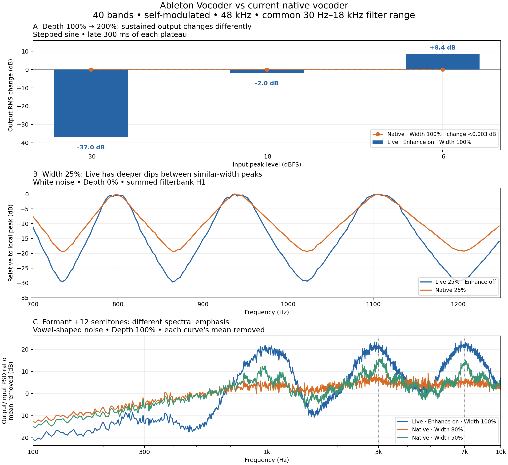

# Current vocoder versus Ableton Live

Measured 3 September 2026, local time, against native DSP at commit
`e3c4b292922e46855595de7659dd9f3741960a4d`. The comparison confirms substantial
differences in Depth, formant shaping, filter bandwidth, and level recovery.
The native semitone conversion itself is correct.



## Conditions

The reference is the real Vocoder in Live 12 Suite, captured through the reusable
[Live Probe bridge](../../../../tools/live_probe/README.md). Carrier is
**Modulator**, with **40 bands, Precise, mono, fully wet, attack 10 ms and
release 30 ms**. Depth and formant measurements include Enhance on and off;
the Width measurement uses Depth 0 and Enhance off to examine the settled
filter response. Gate and unvoiced output are disabled.

Both processors receive identical 48 kHz samples. The common frequency range is
**30 Hz–18 kHz**: the current native minimum is 30 Hz, while Live's maximum is
18 kHz. Native Width spans 0–100%, Live spans 10–200%; native Formant spans
±24 semitones, Live spans ±36. The comparison tests the common formant range.
The saved Live set returns to the user's 20 Hz–18 kHz, Enhance-on baseline after
each batch.

The native measurements run the current C++ DSP through
[render_probe.cpp](../../../render_probe.cpp), including its gain compensation
and protection stages. This is a host build, not an analog recording from the
disting NT. Numerical input samples are matched; DAW dBFS and hardware bus
voltage are not calibrated. Parameter deltas and normalized spectral shapes
are consequently stronger evidence than absolute gain comparisons.

There are 30 completed Live cases: 7 Width, 10 Depth, 10 Formant and 3 Release.
Native comparisons include 12 widths, 14 depth/level combinations, and 20 formant
combinations. Every Live batch completed with no cleanup errors.

## Depth: the implementation cancels sustained changes above 100%

The native code computes a band envelope `E`, then divides it by a moving
average of itself. Above 100%, Depth primarily raises this ratio to an increasing
power. For a constant or nearly steady band envelope, `E / average(E)` approaches
1, so increasing the exponent produces essentially the same gain. Sustained
noise or music can still contain envelope fluctuations. The remaining amplitude term,
`clamp(5 * E, 0, 1)`, does not become stronger with Depth above 100%.
See [computeDepthGain and computeDepthShape](../../../vocoder_algo.cpp#L36) and
[the envelope normalization](../../../vocoder_algo.cpp#L726).

Measured change in sustained output when Depth goes **100% → 200%**, using a
1 kHz stepped sine with 1.25 seconds at each level:

| Input peak | Live, Enhance on | Live, Enhance off | Native, Width 50 or 100 |
| --- | ---: | ---: | ---: |
| −42 dBFS | Effectively silenced | Effectively silenced | Less than 0.003 dB change |
| −30 dBFS | −36.98 dB | −36.40 dB | Less than 0.003 dB change |
| −18 dBFS | −2.02 dB | −1.77 dB | Less than 0.003 dB change |
| −6 dBFS | +8.43 dB | +8.34 dB | Less than 0.003 dB change |

Native 100% → 400% changes sustained output by less than 0.010 dB. Multiplying
native input by five still leaves the 100% → 200% change below 0.006 dB, so the
result survives a substantial change in assumed bus amplitude.

The control does affect transients: the first 100 ms after the initial onset
gains about 7.5–8.7 dB at Depth 200%, and 23.7–29.5 dB at 400%, relative to
100%. This explains why the upper range can feel inactive on sustained material
yet become aggressive on attacks. Live instead changes sustained level contrast
strongly. These probes establish a different transfer law; they do not uniquely
identify Live's internal equation.

Native gain also passes through two soft compressors and a clamp, limiting the
per-band target to about 3.42. Its automatic wet makeup can add up to six times
gain, and operates even at Depth 0. This further couples envelope shape, output
level, and recovery. See [band gain processing](../../../vocoder_algo.cpp#L732)
and [automatic makeup](../../../vocoder_algo.cpp#L822).

[Full Depth plot](depth-comparison.png) · [Measured values](depth-comparison.json)

## Formant: correct shift locations, much weaker spectral shaping

The native shift uses `2^(storedFormant / 120)`, where the stored control is in
tenths of a semitone. Thus +12 semitones correctly doubles synthesis filter
centers while analysis centers remain fixed. See
[rebuildSynthesisDescriptor](../../../vocoder_algo.cpp#L169).

The probe has three broad spectral peaks near 500, 1500, and 3500 Hz. At +12
semitones, Live's output/input spectral ratio has strong peaks near 1015, 3015,
and 7024 Hz. Native Width 50 also produces peaks near 959, 3001, and 7233 Hz,
but their prominence is only about 8.5, 8.6, and 3.3 dB versus Live Enhance-off's
19.1, 15.5, and 13.5 dB. Native Width 80 leaves only one weak broad peak meeting
the analysis prominence threshold.

Measured spectral change from each processor's own zero-shift output, after
removing an overall gain difference (RMS dB over logarithmically spaced
100 Hz–10 kHz samples):

| Processor and Width | Formant −12 | Formant +12 |
| --- | ---: | ---: |
| Live 100%, Enhance on | 11.57 dB | 13.48 dB |
| Live 100%, Enhance off | 12.32 dB | 13.58 dB |
| Native 50% | 6.78 dB | 6.75 dB |
| Native 80% | 3.30 dB | 3.20 dB |
| Native 100% | 2.05 dB | 1.92 dB |

Width 80 is included because it approximately matches Live Width 100's settled,
Depth-0 summed-filter shape. Matching that response does **not** match the
analysis bank's spectral resolution or the active envelope behavior.

Broad native analysis filters, different synthesis widths, and the native
envelope/gain law are plausible contributors to the weak shaping. The current
tests do not isolate their individual contributions. Narrowing native Width
reveals stronger peaks near the expected shifted frequencies, but leaves ripple
and weaker peaks.

Enhance is not the main missing ingredient in this probe: enabling it changes
Live's normalized spectral shape by about 1.8–2.6 dB, while the large native
mismatch exists with it off. Enhance does change overall level substantially.
Raw output still contains the original carrier spectrum in both processors;
this is envelope shaping, not pitch shifting. The plotted output/input PSD
ratio is a measured spectral weighting, not a recovered internal envelope.

Native edge behavior also differs in scope: shifted centers clamp at 30 Hz and
0.49 times sample rate, with fades near the boundaries. A fixed 30 Hz input DC
block remains even if the minimum-frequency parameter is extended. These edge
rules need separate validation before extending Formant to ±36.

[Formant spectral-gain plot](formant_spectral_gain.png) · [Measured values](formant.json)

## Width: different inter-band attenuation and a stopped synthesis control above about 84%

Native Width uses an arbitrary Q curve:

```text
w = Width / 100
analysisQ = 40^(1 − w²) × 0.7^(w²)
synthesisQ = max(3, 0.85 × analysisQ + 1)
```

The synthesis Q reaches its floor at about **83.7% Width**. Native Width 85%,
90%, and 100% produce identical settled waveforms in the Depth-0 test. Analysis
filters keep changing, so this is not a claim that the whole control is inert
at nonzero Depth. At Width 100, analysis Q is 0.7 while synthesis Q is 3.
The Q mapping also does not depend on band spacing or count. See
[rebuildDescriptor](../../../vocoder_algo.cpp#L210).

Around the 940 Hz peak of the summed filterbank response, Live Width 25 and
native Width 25 have similar measured −3 dB bandwidths: approximately 33.6 and
31.8 Hz. These are not isolated-filter measurements. Yet Live's dips between bands
are 29.4–29.7 dB below the peak, versus 19.4 dB natively. Similar peak width
therefore does not imply the same filter skirts or overlap. Narrow Live Width
10 is more selective than even native Width 0; simply reducing native resonance
would not reproduce it. Summed response and phase do not uniquely establish
Live's filter order.

At broad settings, native Width 80 is the best tested shape match for Live
Width 100: about 0.54 dB RMS error over 100 Hz–10 kHz after level matching.
Native 85–100 is almost tied, so this is not a precise parameter conversion.
The uncalibrated native output in this test is about 16.8 dB higher on average.
Width should be fitted using peak width, skirts, overlap, and level together.

[Midband detail](width_midband.png) · [Measured values](width.json)

## Release 30 ms: audible recovery involves more than the release follower

After the −6 → −30 dBFS input step, native Depth 100 undershoots its eventual
quiet output by about 6.8 dB at Width 50 and 15.4 dB at Width 100. It then takes
roughly 256 and 642 ms to remain within 1 dB of the final level. Live's captured
Release 10/30/100 ms cases barely undershoot. Their corresponding recovery
after the detected output fall is approximately 21/21/56 ms, with about 20 ms
alignment uncertainty.

These are effective output responses, not estimates of either processor's
internal release constant. Native has additional 15/50 ms envelope averaging,
10/120 ms level averaging, and 50/8 ms makeup smoothing. Their interaction must
be considered when making Release 30 ms sound right.

[Release recovery](release-response.png) · [Measured values](release-response.json)

## Repair priorities

1. Replace the self-normalized transient Depth law with a sustained per-band
   contrast law fitted against the measured level steps. Fit 0, 50, 100, 150,
   and 200%, across levels, rather than extending the current exponent range.
2. Separate automatic makeup from the core bank/envelope comparison, then fit
   level compensation explicitly. Keep output protection, but measure where it
   becomes active. Verify step-down recovery at Release 30 ms.
3. Calibrate analysis and synthesis filter shapes independently: band centers,
   peak bandwidth, skirts, phase/overlap, and Width range. Remove the unintended
   synthesis plateau and relate widths to band spacing.
4. Re-run the formant probe after those changes. Fit envelope relocation and
   edge behavior using the measured spectral gain; the semitone multiplier is
   already correct. Extend the requested ranges after the common range works.

## Data and reproduction

[Provenance](provenance.json) records the DSP commit, source hashes, manifests,
and capture directories. Raw WAVs, readbacks, render metadata and spectral arrays
remain under:

```text
C:/Users/tsarpf/Documents/Ableton/LiveProbe/comparisons/20260903-vocoder-current
```

The [comparison commands](../../../../tools/live_probe/README.md#compare-the-native-vocoder-with-live)
generate new inputs, record the reference, render the native DSP, and regenerate
the analysis. Keep this baseline directory unchanged when testing a new DSP
revision; use another comparison directory for new measurements.

Signal preparation uses deterministic noise with a −18 dBFS sample peak limit,
and a three-peak shaped-noise probe at −18 dBFS peak. Width analysis uses a
settled 2.5-second noise window, 16384-sample Hann FFTs with 50% overlap, and H1
transfer estimates; representative median coherence exceeds 0.9999. Finite FFT
resolution is about 2.93 Hz, so narrow-band Q estimates are approximate. Depth
uses the last 300 ms of each plateau, with an extra 40 ms edge guard for Live.

Direct Source-to-Capture bypass checks preserved impulse and sine amplitudes
to approximately 10⁻¹⁰ absolute sample error. A cold impulse is heavily
suppressed by the reference's startup behavior even at Depth 0, so it was not
used as an LTI filter estimate. These stationary probes and stepped tones are
a controlled diagnosis, not a full perceptual match across speech, music,
stereo modes, levels, and every parameter combination.
