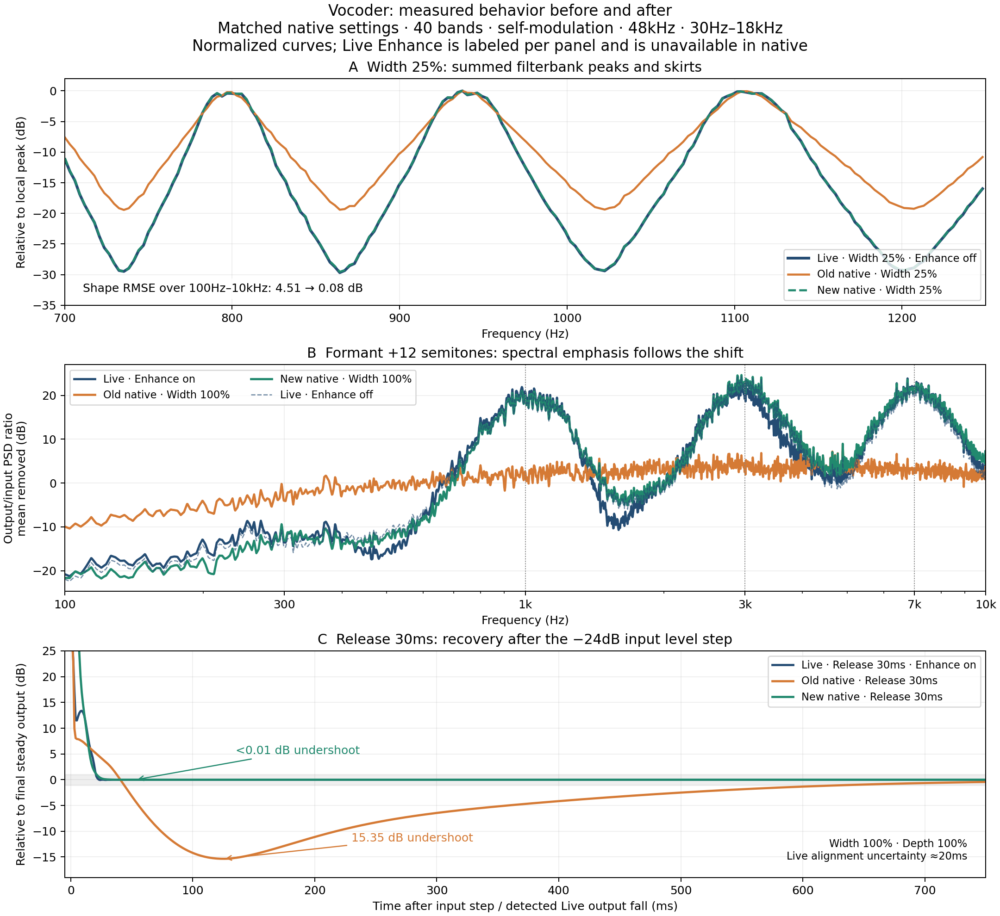

# Vocoder filterbank and envelope update

The filterbank now closely matches the measured Live response, and Depth above
100% changes sustained contrast. Formant shaping and Release recovery improve
substantially as a result.



## What changed

The old single-biquad bank was replaced by **fourth-order Butterworth bandpass
filters**, each comprising two distinct second-order sections. Adjacent synthesis
bands alternate polarity. This combination fits the measured peaks, inter-band
attenuation, and phase much better than merely adjusting the old Q curve or
cascading identical filters.

The measured Width law is approximately `Q = 6.457 / widthFraction` for 40 bands
from 30 Hz to 18 kHz. This is the bandpass prototype Q, not either individual
section's Q. The implementation scales it with log band spacing and compensates
for digital bandwidth compression near Nyquist. Analysis and synthesis have the
same bandwidth; the old synthesis-Q floor is gone. Fixed gain compensation
replaces the automatic wet/dry volume boost.

A trapezoidal state-variable realization preserves the same transfer function
with much better float32 accuracy at narrow bass settings. Against a double
precision SciPy reference, the checked response differs by at most **0.028 dB**
at 20 Hz/high Q and less than **0.004 dB** above 100 Hz. Control movement retains
running filter state; changing band count clears histories whose frequency
identities have changed. Extremely small states are flushed to zero.

Depth now acts on an absolute band envelope. At 0% the band gain is unity; at
100% it follows the envelope; above 100% a fitted expansion curve increases
sustained contrast. The old envelope/self-average division and both per-band
compressors were removed. A fixed 0.1362 V reference replaces the self-normalized
ratio. Release is calibrated against the measured control behavior, with 1 ms
band-gain interpolation. Overload protection remains, with the attenuation
threshold raised from 5.5 V to the existing 9 V soft-knee ceiling; the output
still approaches a bound of ±10 V.

Width now spans **0–200%**, Depth **0–200%**, Formant **±36 semitones**, and the
lower frequency limit is **20 Hz**. The upper limit remains 20 kHz. Parameter
indices are preserved, including the reserved Enhance slot. Older Depth values
above 200% clamp to 200%. Existing presets keep their stored values but sound
different with the corrected processing. Full details are in [SPECS.md](../../../SPECS.md).

## Measured improvement

The same saved reference captures are used throughout: real Live Vocoder,
Modulator carrier, 40 bands, Precise, 48 kHz, common 30 Hz–18 kHz range. Width
measurements use Depth 0 and Enhance off. The native renderer contains the
actual production filter/envelope code and its output protection.

Width shape error after removing one constant gain offset, over 100 Hz–10 kHz
with linear-frequency weighting:

| Width | Old native RMS error | New native RMS error |
| --- | ---: | ---: |
| 10% | 8.72 dB | 0.10 dB |
| 25% | 4.51 dB | 0.08 dB |
| 50% | 1.87 dB | 0.08 dB |
| 75% | 1.22 dB | 0.08 dB |
| 100% | 0.54 dB | 0.08 dB |
| 150% | Unsupported | 0.08 dB |
| 200% | Unsupported | 0.09 dB |

The new average gain difference from Live is also small, about 0.02–0.09 dB in
these noise probes. The fitting procedure held out whole bands; the selected
model also predicts those bands well. It is a practical approximation to the
observed response, not proof of Live's internal implementation.

For the three-peak shaped-noise probe at **Formant +12**, with Width 100 on both
native revisions, normalized spectral-shape error against **Live Enhance on**
falls from **10.88 to 2.31 dB**. Against Enhance off it falls from **10.67 to
1.43 dB**. The new spectrum changes by 13.86 dB RMS from its own zero-shift
spectrum, versus Live Enhance-on's 13.48 dB and the old native's 1.92 dB. The
shifted peaks are now clearly expressed. The semitone conversion itself remains
unchanged.

At a −30 dBFS 1 kHz input, **Depth 100→200%** now reduces sustained output by
**33.51 dB**, versus about 36–37 dB in Live and less than 0.003 dB in the original
native probe. On the unclipped levels, gain-relative-to-Depth-0 error against
Enhance-off is at most 0.11 dB at Depth 100%, 0.48 dB at 50%, and 1.46 dB at
150%. Depth 200% still differs by roughly ±2.9 dB at its two nonzero unclipped
points. At the loudest −6 dBFS input, native Depth 100→200 gains 3.41 dB; output
protection limits larger gains, unlike Live's floating-point signal path.

For **Release 30 ms, Width 100%**, effective settling after a −24 dB input step
improves from approximately **642 ms to 22 ms**. The old 15.35 dB undershoot
falls below **0.01 dB**. Live settles in about 21 ms on this probe. Live alignment
has approximately 20 ms uncertainty; these are whole-output response metrics,
not measurements of an internal time constant. At Width 50, new settling is
about 35 ms with 0.26 dB undershoot.

## Listening example

`formant-plus12-live-old-new.wav` in the raw comparison's `analysis/` folder
contains three 2.5-second segments separated by silence:

1. Live, Enhance on: 0–2.5 seconds.
2. Previous native, Width 100: 2.8–5.3 seconds.
3. Updated native, Width 100: 5.6–8.1 seconds.

All use +12 semitones. Each segment is matched to −20 dBFS RMS after short fades;
raw captures are unchanged. This compares timbre rather than output loudness.
The figure plots output/input spectral power ratios with overall gain removed,
not reconstructed internal envelopes.

## Validation and limits

The host regression suite and ASan/UBSan checks pass, including disabled copy
elision. Checks cover all filter stages and owner pointers, 20 Hz/high-Q center
accuracy, sustained Depth, level-linear Depth 0, release recovery, stereo/routing,
full parameter ranges, and extreme control movement. The ARM plugin builds.

The connected disting NT measured the fourth-order float baseline at 43.0%
algorithm CPU. The corrected fused-float implementation measures 38.1% static
and 38.0% during Width/Formant motion at 40 bands. A mixed Q31 prototype reached
33.6% but failed expanded range, transient, and state-history checks and was
rejected. The production bank remains float throughout. The corrected object
is installed and the original Matrix Mixer preset is restored. Full protocol,
object hashes, and rejected integer experiments are recorded in
[device-performance.json](device-performance.json).

Enhance remains unimplemented. After gain matching, residual formant-shape
errors against Enhance-on are about 2.3–3.3 dB across the tested shifts. This
work does not claim a complete perceptual clone across music, speech, stereo,
all band counts, or every parameter combination. Very narrow reference-like
filters still ring, and extreme formant shifts retain native edge fades.

The updated WAV renderer explicitly maps ±1 to ±5 bus volts, then divides output
by five. Original baseline measurements used raw numerical bus samples. A
separate legacy rerender at the new voltage convention changed normalized
Formant spectra by less than **0.33 dB**; old +12 error against Enhance-on was
11.07 dB rather than 10.88 dB, so the large improvement is robust. Absolute old
output gains are not presented as calibrated hardware measurements. The earlier
five-times-input Depth check likewise confirmed the original cancellation above
100%.

## Reproduce and inspect

- [Revision summary](revision_comparison.json)
- [Width measurements](width.json)
- [Formant measurements](formant.json)
- [Depth errors](depth-final-errors.json)
- [Release response](release-response.json)
- [Filter fitting notes](filterbank_fit_notes.md)
- [C++ filter verification](filterbank_cpp_check.json)
- [Host performance measurements](host-performance.json)
- [Legacy voltage-convention check](legacy-voltage-check.json)
- [Source provenance](provenance.json)

Raw audio, spectral arrays, parameter readbacks, and render metadata remain at:

```text
C:/Users/tsarpf/Documents/Ableton/LiveProbe/comparisons/20260903-vocoder-filterbank-v2
```

The original `20260903-vocoder-current` recordings are preserved. Capture,
rendering, fitting and before/after commands are in
[Live Probe](../../../../tools/live_probe/README.md#compare-the-native-vocoder-with-live).
The public numerical references used are the
[W3C Audio EQ Cookbook](https://www.w3.org/TR/audio-eq-cookbook/) and
[Simper's trapezoidal SVF derivation](https://cytomic.com/files/dsp/SvfLinearTrapOptimised2.pdf).
