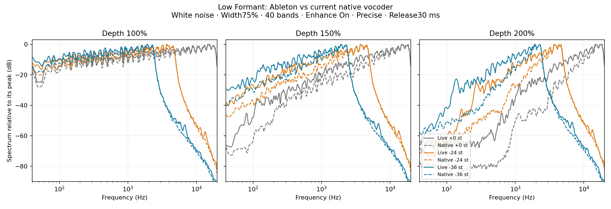
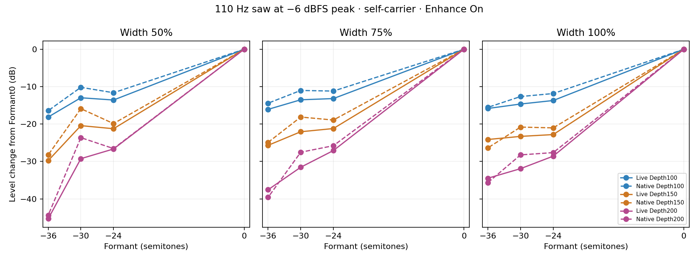

# Very low Formant: measured Live behavior

Measured 36 settings in Ableton Live's Vocoder: Formant0/−24/−30/−36 semitones,
Width50/75/100%, Depth100/150/200%. All use the saved40-band Modulator-carrier
probe set, Enhance On, Precise, 20 Hz–18 kHz, Attack10 ms, Release30 ms,
wet100%, zero output gain and disabled gate. The native comparison is commit
`47cfaf5`, with matching parameters and5 V per WAV full scale. This investigation
changes no DSP and does not upload anything to the NT.

## Findings

**Live also loses treble at large downward Formant shifts.** The following
ranges contain95% of the white-noise output power, across all nine Width/Depth
combinations at each Formant. They are energy statistics, not hard cutoffs.

| Formant | Nominal highest shifted center | Live95% energy frequency |
| --- | ---: | ---: |
| 0 | 18 kHz | 18.20–18.74 kHz |
| −24 | 4.5 kHz | 4.62–4.79 kHz |
| −30 | 3.182 kHz | 3.26–3.40 kHz |
| −36 | 2.25 kHz | 2.31–2.40 kHz |

The native95% energy frequency differs from Live by at most1.1% for negative
shifts. This strongly supports translating the carrier bank in logarithmic
frequency, rather than redistributing the shifted bands across the original
full range. These captures do not identify every internal band or prove Live's
exact filter design.

**Our high-Depth gain and harmonic balance remain too aggressive.** This is
visible even in zero-shift baselines. At Formant−36, Width75, with a110 Hz saw
at−6 dBFS peak, measurements in the guarded loud-saw window are:

| Depth | Live RMS dBFS | Native RMS dBFS | Native minus Live |
| --- | ---: | ---: | ---: |
| 100% | −32.1 | −34.8 | −2.7 dB |
| 150% | −38.5 | −46.6 | −8.1 dB |
| 200% | −46.5 | −61.9 | −15.3 dB |

At Depth150, the330 Hz harmonic is about15.1 dB below the fundamental in Live
but28.7 dB below in native. At Depth200, the660 Hz harmonic is about23.5 dB
below the fundamental in Live versus47.5 dB in native. A makeup-gain adjustment
alone cannot correct this difference. At Width75/Depth200, native white noise
is around7.6–7.7 dB quieter across all four Formants; the error is not unique
to negative Formant. The earlier narrow tone calibration did not establish a
match for these broadband/harmonic cases.

**Live has a different low-frequency boundary behavior.** Two extra captures
at Formant−36, Width75, Depth200 checked quiet-saw settling. After a loud-to-quiet
step, a decaying peak near14 Hz dominates the output0.8–1.8 seconds after the
step (−66.3 dBFS RMS,99.9% of power below40 Hz). By2.5 seconds after the step,
output settles near−95.5 dBFS and the strongest frequency is110 Hz. A direct
white-noise-to-quiet-saw capture reaches the same late level. Silence also
produces a decaying14 Hz tail.

That is evidence consistent with carrier filters continuing below20 Hz:
110/8 =13.75 Hz. It differs from our explicit20 Hz synthesis clamp and10–20 Hz
fade. It does not establish Live's exact lowest allowable frequency or prove
how every boundary band is handled. The apparent huge native/Live differences
in some short quiet-saw windows include this transient; do not interpret all
of those windows as settled gain measurements.

## Plots and data



Solid lines are Live; dashed lines are native. Each curve is normalized to its
own spectral peak, so this plot compares shape rather than absolute level.
The outer high-frequency edge agrees closely; inside the passband, native
rejects more low-energy bands at high Depth.



Each processor is referenced to its own zero-Formant level. Absolute level
errors are separately available in `metrics.csv` and `comparison.json`.
`provenance.json` identifies all38 actual Live captures, hashes, paths and
successful parameter cleanup. Raw WAV files stay in the LiveProbe directory.
`settling-results.json` records the additional long-step diagnostic.

The first white-noise section provides correlation alignment, using a band
that moves with Formant. Detecting the first nonzero output sample is unreliable
because bass tails can precede playback. Guarded1.05-second analysis windows
start0.8 seconds into each2-second signal segment. Noise uses a fixed seed;
the saw contains harmonics up to22 kHz, avoiding source aliasing. Rolloff and
harmonic observations are measurements; perceived quality still needs listening.

## Reproduce

```sh
make -C vocoder render-probe
python3 -m tools.live_probe.measure_low_formant \
  --root /path/on/windows/drive/comparison --native-only
python3 -m tools.live_probe.measure_low_formant \
  --root /path/on/windows/drive/comparison --capture \
  --bridge /path/on/windows/drive/LiveProbe/bridge
python3 -m tools.live_probe.plot_low_formant --root /path/to/comparison
```

The capture resumes incomplete runs and restores touched Live parameters.
Plotting requires Matplotlib in addition to NumPy/SciPy/SoundFile. Native
renders are reused only when the input, executable and case definitions match.

The next DSP work should address the high-Depth envelope/gain mapping and the
lower synthesis-frequency boundary. Adding a treble shelf would not correct
the measured harmonic weighting, and extending the top end artificially would
move away from the observed Live behavior.
